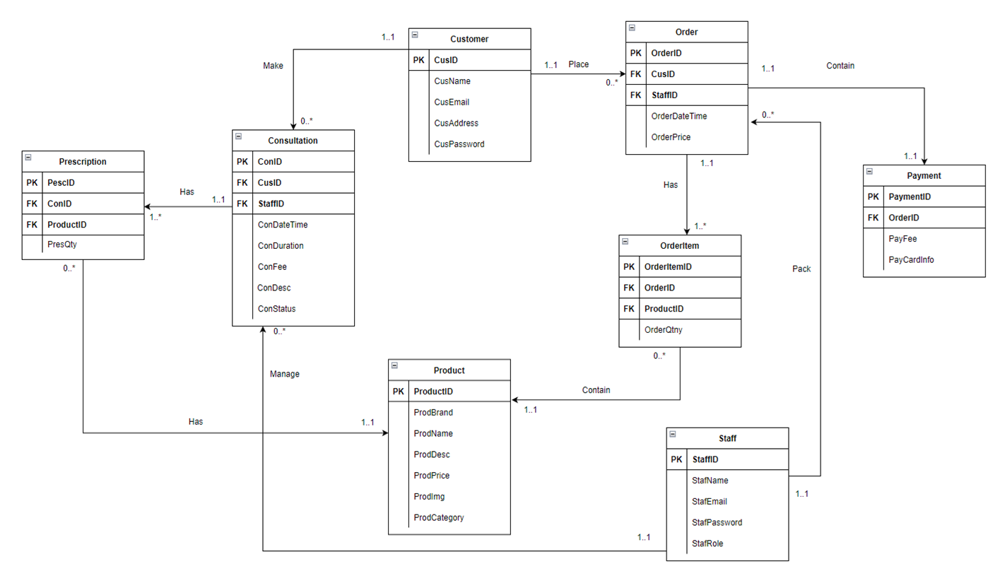
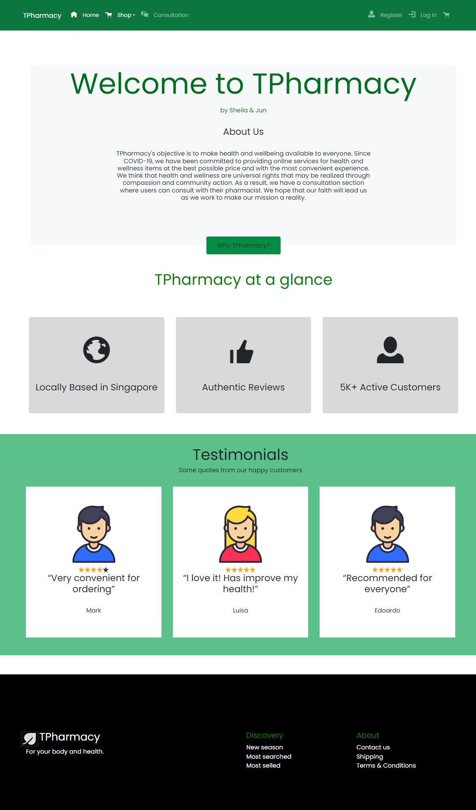
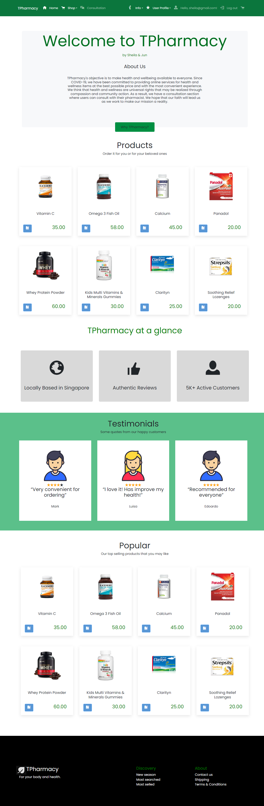
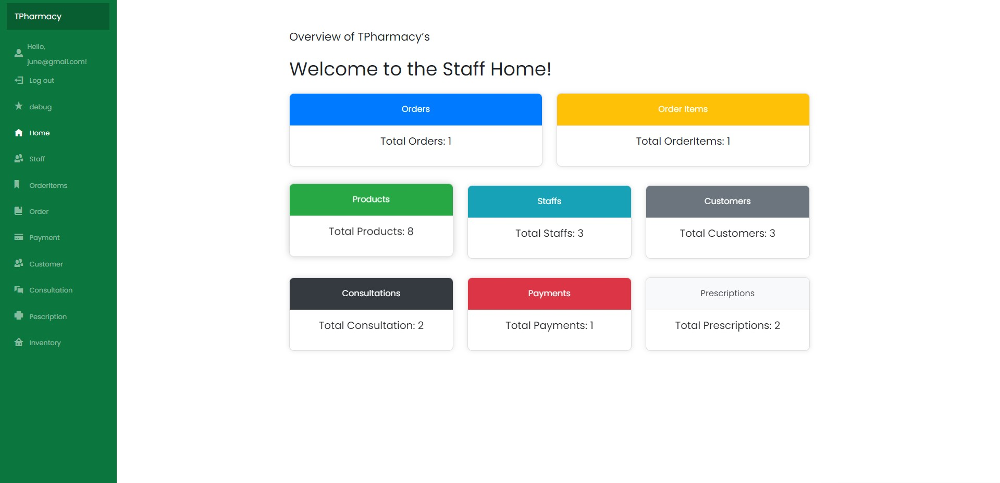

# TPharmacy - Online Pharmacy Website
TPharmacy Pte Ltd is a traditional pharmacy that provides beauty, personal care, health care and pharmaceutical products in their stores, along with essential services such as medicine dispensing, professional pharmacist assistance, and counseling on medical conditions and prescriptions. However, with the COVID-19 pandemic, the number of walk-in clients and retail sales reduced, leading to increased competition between retail pharmacies, including big-box retailers, mail-order, and online pharmacies.

To keep up with the trend and attract a broader customer base, TPharmacy Pte Ltd decided to build an appealing online pharmacy website that embraces digital technologies to deliver various pharmacy services and online ordering. According to a Visa study, nearly 74% of consumers in Singapore are shopping online more frequently as a result of the Covid-19 pandemic, and revenue in the Online Pharmacy segment is projected to reach $267.10m in 2022.

TPharmacy online pharmacy website is built using Visual Studio 2019 and .Net 5 Blazor Web Assembly. Blazor Web Assembly allows for the development of rich, interactive web applications using C# and .NET. It enables developers to build fully functional client-side web applications using .NET code, which runs directly in the browser. By using Blazor Web Assembly, TPharmacy is able to create a fast and responsive web application that can deliver an excellent user experience to its customers. The use of .NET 5 also ensures that the application is highly performant and scalable, making it a reliable choice for an online pharmacy website that needs to handle a large volume of customer traffic.

For this project, I created entities for Staff, Order, OrderItem, and Payment and implemented Unit of Works (Repository & IRepository) for all entities. I also performed seeding for User, UseRole, Role, Staff, Order, OrderItem, and Payment entities. I completed the Staff Landing Page and Staff NavBar, along with the controller for Staff, Order, OrderItem, and Payment. I tested these controllers using Postman.

### Customer Features
For customers, they can purchase any supplements of their choice, which will create the Order, OrderId session and create an Orderitem. They can also update/delete their OrderItem only and view their Order Details only. Customers can view their summary of the OrderItem with the Product Details only and check out their order which would update the Order Status to Completed. They can also make payment for orders that haven’t been paid, which would update the Order Status to Paid. Customers can also edit their Payment Details and view the summary of the Payment Details.

### Staff Features
For staff, they can create/update/delete Staff, which will sync with the Identity User and Identity Role. They can also update the Order Status and Staff ID to completed or another staff. The Staff Home page is a dashboard that is based on the count for each entity that will update accordingly. Staff can view all the customer Orders with Details, all the customer OrderItem with Product Details, and all the customer Payment with Details. They can view the entire Order & Payment Summary, along with the details of the individual Order, OrderItem, and Payment. Staff can also view a summary of total orders and sales amount earned, along with a summary of orders for order processing.

### ERD
 

### HomePage
 

### Customer SignIn Homepage
 

### Customer Staff Homepage
 

